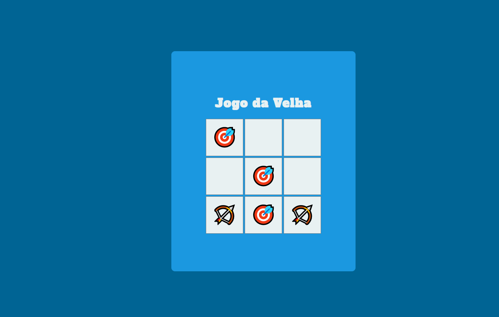
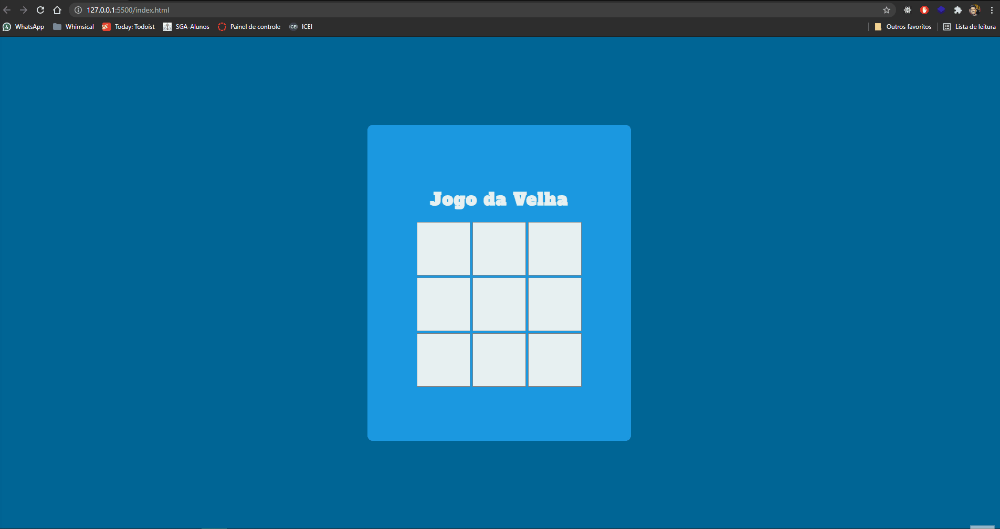

<h1 align="center">Jogo da Velha</h1>

  
<h3 align="center">
  
</h3>
<h2>Sobre:</h2>

Este é um jogo de dois jogadores em JavaScript desenvolvido para web.

<h3>Tecnologias:</h3>

HTML, CSS e JavaScript

<h3>Status do Projeto:</h3>

✔ Finalizado

<h2>Simulação:</h2>

